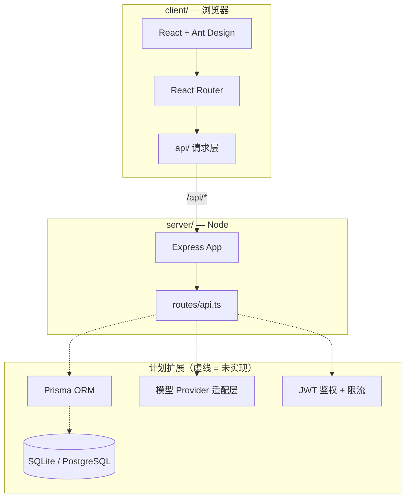
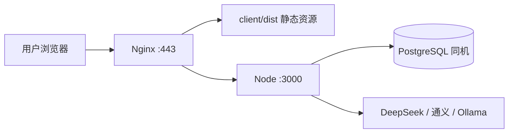

# 总体设计文档（留痕）

> **文档目的**：记录项目愿景、技术选型、架构边界与演进路线。后续发生设计变更或技术栈替换时，以此为基准做增量更新，保证过渡可追踪、可回滚、可沟通。
>
> **变更留痕**：完成相关代码或配置改动后，在 Cursor 中执行 **stack-changelog** skill（对话输入 `stack-changelog` 或「技术栈留痕」），由 Agent 将变更摘要与**理由**同步到本文档（尤其 §2.1、§9）。Skill 路径：[`.cursor/skills/stack-changelog/`](../.cursor/skills/stack-changelog/SKILL.md)。
>
> **Push 门禁**：`git push` 前自动检查（`.githooks/pre-push` + Cursor `beforeShellExecution`）。技术栈相关文件已改但本文档未同步时，**拒绝 push**；须先执行 stack-changelog。自检：`npm run check:stack-changelog`。
>
> **最后更新**：2026-06-18  
> **文档版本**：v0.2.0  
> **项目阶段**：Phase 1（进行中）— SQLite + Prisma 已接入，posts 持久化

---

## 1. 项目定位

### 1.1 愿景

打造一个**属于自己的作品**：个人网站 + 可扩展的自定义 AI 对话能力，面向**小体量用户**（约 10～200 人）可持续运行。

### 1.2 核心原则

| 原则 | 说明 |
|------|------|
| **先跑通，再完善** | 优先 MVP，避免过早引入复杂中间件 |
| **前后端分离** | 前端 SPA，后端 REST/SSE API，接口契约稳定 |
| **统一 JS/TS 生态** | 降低上下文切换成本（Node 熟悉度 > Python 从零） |
| **模型外置** | 不自研大模型，通过 API 接入；价值在自定义功能与体验 |
| **成本可控** | 小体量场景：单 VPS、限流、API Key 服务端托管 |

### 1.3 演进阶段（Roadmap）

```
Phase 0 [已完成]  个人网站脚手架（首页 / 关于 / 示例 API）
    ↓
Phase 1 [进行中]  内容能力（Markdown 文章、详情页、SQLite + Prisma）
    ↓
Phase 2         AI 对话 MVP（模型切换、流式输出、Prompt 功能模板）
    ↓
Phase 3         小体量多用户（登录、会话隔离、日限额、部署上线）
    ↓
Phase 4         差异化功能（工具调用、RAG、可选本地 Ollama）
```

> 变更 Roadmap 时，执行 **stack-changelog** skill 或在 [§9 设计变更记录](#9-设计变更记录) 追加条目，并更新本节版本号。

---

## 2. 当前技术栈

### 2.1 栈总览

| 层级 | 选型 | 版本（截至 2026-06-18） | 状态 |
|------|------|-------------------------|------|
| 前端框架 | React | ^19.2 | ✅ 已采用 |
| 前端语言 | TypeScript | ~6.0 | ✅ 已采用 |
| 构建工具 | Vite | ^8.0 | ✅ 已采用 |
| UI 组件库 | Ant Design | ^6.4 | ✅ 已采用 |
| 路由 | react-router-dom | ^7.18 | ✅ 已采用 |
| 后端运行时 | Node.js | — | ✅ 已采用 |
| 后端框架 | Express | ^5.1 | ✅ 已采用 |
| 后端语言 | TypeScript | ^5.9 | ✅ 已采用 |
| 数据库 | SQLite | dev.db（`server/prisma/`） | ✅ 已接入 |
| ORM | Prisma | ^6.19 | ✅ 已采用 |
| AI 模型 | — | — | ⏳ 计划 DeepSeek 等 API + 可选 Ollama |
| 部署 | — | — | ⏳ 计划单 VPS + Nginx + pm2 |

### 2.2 已否决 / 暂缓的选项

| 选项 | 结论 | 理由 | 复评条件 |
|------|------|------|----------|
| Python 后端 | 否决（当前阶段） | Node 更熟悉，与前端 TS 生态统一 | 强依赖 Python AI 库且 Node 无法满足 |
| 微服务 / K8s | 暂缓 | 小体量过度设计 | 用户 >1000 或团队多人协作 |
| 独立云数据库 | 暂缓 | 单 VPS 可同机部署 PG | 并发写入瓶颈或需异地容灾 |
| 前端直连模型 API | 否决 | Key 暴露、无法统一限流 | 永不采用（生产环境） |
| LangChain 全家桶 | 暂缓 | MVP 复杂度过高 | Phase 4 需要 Agent/RAG 时再评估 |

---

## 3. 系统架构

### 3.1 逻辑架构



### 3.2 物理部署（目标态 · Phase 3）



### 3.3 开发环境

| 服务 | 地址 | 说明 |
|------|------|------|
| 前端 dev | http://localhost:5173 | Vite HMR |
| 后端 dev | http://localhost:3000 | tsx watch 热重载 |
| API 代理 | `/api` → `:3000` | 见 `client/vite.config.ts` |

---

## 4. 目录结构约定

```
node/
├── client/                    # 前端（独立 package.json）
│   ├── src/
│   │   ├── api/               # 【稳定边界】所有后端请求集中在此
│   │   ├── pages/             # 页面级组件
│   │   ├── App.tsx            # 布局 + 路由
│   │   └── main.tsx           # 入口 + Ant Design ConfigProvider
│   └── vite.config.ts         # 开发代理配置
├── server/                    # 后端（独立 package.json）
│   ├── prisma/
│   │   ├── schema.prisma      # 数据模型
│   │   ├── seed.ts            # 种子数据
│   │   ├── dev.db             # SQLite 数据库文件（本地，不入库）
│   │   └── migrations/        # 迁移历史
│   └── src/
│       ├── db.ts              # Prisma Client 单例
│       ├── index.ts           # 应用入口
│       └── routes/            # 路由模块
├── docs/
│   └── DESIGN.md              # 本文档
├── package.json               # 根脚本（concurrently 启停）
└── README.md                  # 快速上手（指向本文档）
```

### 4.1 扩展目录（Phase 1+ 计划）

```
server/
├── prisma/                    # ✅ 已创建
│   ├── schema.prisma
│   ├── seed.ts
│   └── migrations/
├── src/
│   ├── db.ts                  # ✅ 已创建
│   ├── middleware/            # auth、rateLimit（待建）
│   ├── providers/             # AI 模型适配（待建）
│   ├── features/              # 自定义功能（待建）
│   └── routes/
│       ├── api.ts             # 健康检查、posts
│       └── chat.ts            # 对话 SSE（待建）

client/src/
├── pages/
│   ├── Chat/                  # AI 对话页
│   └── ...
└── components/                # 可复用 UI 块
```

> **约定**：前端 `pages/` 对应路由；后端 `routes/` 对应 API 域；`api/` 是唯一 HTTP 出口，换后端实现时优先改这里。

---

## 5. API 契约（稳定边界）

> 前后端协作以本节为准。变更接口时：**先改文档 → 再改实现 → 记录 §9**。

### 5.1 已实现

#### `GET /api/health`

健康检查，部署探针与前端连接状态检测用。

```json
{ "status": "ok", "timestamp": "2026-06-18T07:00:00.000Z" }
```

#### `GET /api/posts`

文章列表（**SQLite + Prisma 持久化**，按 `createdAt` 降序）。

```typescript
// 响应：Post[]
interface Post {
  id: number
  title: string
  summary: string
  createdAt: string   // ISO 8601
}
```

#### `GET /api/posts/:id`

文章详情（含 `content` 字段）。

```typescript
interface PostDetail extends Post {
  content: string
}
```

### 5.2 计划接口（Phase 1～3）

| 接口 | 方法 | 说明 |
|------|------|------|
| `/api/posts` | POST | 创建文章（需鉴权） |
| `/api/chat` | POST | 对话（SSE 流式） |
| `/api/models` | GET | 可用模型列表 |
| `/api/features` | GET | 自定义功能列表 |
| `/api/auth/register` | POST | 注册 |
| `/api/auth/login` | POST | 登录，返回 JWT |
| `/api/sessions` | GET/POST | 会话 CRUD |

#### 计划：`POST /api/chat` 请求体（草案）

```typescript
interface ChatRequest {
  model: string              // 如 "deepseek-chat"
  feature?: string           // 自定义功能 id，如 "polish" | "summarize"
  messages: { role: 'user' | 'assistant' | 'system'; content: string }[]
  sessionId?: string
}
// 响应：text/event-stream（SSE）
```

> **迁移提示**：若改用 WebSocket，保留 `ChatRequest` 语义，仅替换传输层；前端 `api/chat.ts` 单独封装。

---

## 6. 关键设计决策（ADR 摘要）

| ID | 决策 | 日期 | 理由 |
|----|------|------|------|
| ADR-001 | 前后端 monorepo，双 package | 2026-06-18 | 一键 `npm run dev`，职责清晰，可独立构建 |
| ADR-002 | 后端 TypeScript + tsx | 2026-06-18 | 与前端类型可共享；dev 体验好 |
| ADR-003 | Ant Design + 中文 locale | 2026-06-18 | 个人站 + 对话 UI 成熟；@ant-design/x 可后续引入 |
| ADR-004 | 开发期 Vite 代理 `/api` | 2026-06-18 | 避免 CORS；生产由 Nginx 反代 |
| ADR-005 | 数据库路线 SQLite → PG | 2026-06-18 | 零配置起步，小体量同机 PG 可平滑迁移 |
| ADR-006 | 模型 OpenAI 兼容接口 | 2026-06-18 | 一套 adapter 切换 DeepSeek/Ollama/OpenAI |
| ADR-007 | 小体量单 VPS，不买独立云库 | 2026-06-18 | 成本约 100～200 元/月，运维简单 |
| ADR-008 | API Key 仅服务端 | 2026-06-18 | 安全 + 统一限流计费 |

---

## 7. 技术栈变更指南（丝滑过渡）

> 变更前：复制本节相关 checklist，完成后在 §9 记录。

### 7.1 接入数据库（SQLite + Prisma）

**影响范围**：`server/`  
**前端影响**：无（若保持 §5 API 形状）

1. `server/` 安装 `@prisma/client`、`prisma`
2. 新增 `prisma/schema.prisma`、`src/db.ts`
3. `routes/api.ts` 中 posts 改为 `prisma.post.findMany()`
4. `.env` 加入 `DATABASE_URL`，确认已在 `.gitignore`
5. 更新 §2.1 栈表、§9 变更记录

**回滚**：恢复硬编码数组；删除 prisma 目录与迁移。

---

### 7.2 后端 Node → Python（FastAPI 等）

**影响范围**：`server/` 整体替换  
**稳定边界**：§5 API 契约、`client/src/api/`

1. 新后端实现相同 URL 与 JSON 形状
2. 前端仅改 `vite.config.ts` 代理目标（若端口变）
3. 根 `package.json` 的 `dev:server` 指向新启动命令
4. 更新 §2.1、§4 目录说明、§9

**建议**：新旧后端并行一周，用 `/api/health` 切换验证。

---

### 7.3 前端 React → 其他框架（Vue 等）

**影响范围**：`client/` 整体替换  
**稳定边界**：§5 API 契约

1. 新前端调用相同 `/api/*` 接口
2. 构建产物仍输出到 `client/dist`（或改 Nginx 配置并文档化）
3. 根脚本 `dev:client` / `build` 更新

---

### 7.4 换 UI 库（Ant Design → 其他）

**影响范围**：`client/src` 组件层  
**稳定边界**：`api/`、路由路径、业务逻辑 hooks

1. 逐页迁移，优先布局（App.tsx）再页面
2. 若引入 `@ant-design/x`（对话 UI），记录在 §2.1

---

### 7.5 换 AI 模型供应商

**影响范围**：`server/src/providers/`（待建）  
**稳定边界**：`POST /api/chat` 请求/响应语义

1. 新增 provider 配置项：`baseURL`、`apiKey`、`model` 映射
2. 前端 `GET /api/models` 列表同步更新
3. 环境变量：`DEEPSEEK_API_KEY` 等，不入库

**OpenAI 兼容 provider 模板**：

```typescript
// providers/types.ts — 建议未来采用
interface ProviderConfig {
  id: string
  baseURL: string
  apiKey: string
  models: string[]
}
```

---

### 7.6 开发 → 生产部署

**影响范围**：运维配置，非业务代码

| 项 | 开发 | 生产 |
|----|------|------|
| 前端 | Vite dev :5173 | Nginx 托管 `client/dist` |
| 后端 | tsx watch :3000 | pm2 运行 `node dist/index.js` |
| API | Vite proxy | Nginx `location /api` 反代 |
| 数据库 | SQLite 文件 | 同机 PostgreSQL |
| 密钥 | `.env` 本地 | 服务器环境变量 |

---

### 7.7 小体量 → 更大规模

| 信号 | 动作 |
|------|------|
| SQLite 写锁频繁 | 迁 PostgreSQL |
| 单核 CPU 长期 >80% | 升配或前后端分机 |
| 同时在线 >50 | 评估 Redis 会话、队列 |
| API 月费超预期 | 加强限流、默认便宜模型 |

---

## 8. 环境变量规划

| 变量 | 阶段 | 说明 |
|------|------|------|
| `PORT` | Phase 0 | 后端端口，默认 3000 |
| `DATABASE_URL` | Phase 1 | Prisma 连接串 |
| `JWT_SECRET` | Phase 3 | 鉴权 |
| `DEEPSEEK_API_KEY` | Phase 2 | 模型 API |
| `OLLAMA_BASE_URL` | Phase 4 | 本地模型，如 `http://localhost:11434/v1` |

> 所有密钥：**仅 server 读取，禁止 `VITE_` 前缀暴露到前端。**

---

## 9. 设计变更记录

> 每次架构/栈/接口变更，**先执行 stack-changelog skill**（推荐），或手动追加一行；须含变更**理由**。**格式不可删改，只追加。**

| 版本 | 日期 | 变更摘要 | 影响范围 | 负责人 |
|------|------|----------|----------|--------|
| v0.1.0 | 2026-06-18 | 初版：monorepo 脚手架；React+Node 栈；posts 硬编码 API；Roadmap Phase 0～4 | 全项目 | — |
| v0.2.0 | 2026-06-18 | 接入 SQLite + Prisma 6；Post 模型与迁移；seed 示例文章；posts 改读库；新增 GET /api/posts/:id | server/、docs/ | — |

### 变更模板（复制使用）

```markdown
| vX.Y.Z | YYYY-MM-DD | 【摘要】 | client/server/docs/... | 姓名 |
```

---

## 10. 相关文档

| 文档 / 工具 | 用途 |
|-------------|------|
| [README.md](../README.md) | 安装、启动、常用命令 |
| 本文档 `docs/DESIGN.md` | 架构、契约、演进、迁移 |
| [`.cursor/skills/stack-changelog/`](../.cursor/skills/stack-changelog/SKILL.md) | 技术栈/设计变更留痕（对话触发 `stack-changelog`） |
| [`.cursor/skills/crm/`](../.cursor/skills/crm/SKILL.md) | 提交→拉取→推送（对话触发 `crm`）；push 前联动 stack-changelog |

---

## 11. 快速检查清单（发布 / 大改前）

- [ ] §5 API 契约与实现一致
- [ ] 已执行 **stack-changelog** skill（或手动同步 §2.1、§9）
- [ ] §2.1 技术栈表已更新
- [ ] §9 已追加变更记录（含理由）
- [ ] `.env` 未提交，密钥在服务端
- [ ] `npm run build` 前后端均通过
- [ ] 新 Phase 目标与 §1.3 Roadmap 对齐
